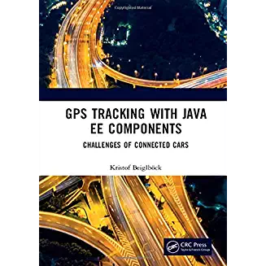

The JeeTS Source Repository
===========================

The JeeTS Source Repository is hosting the code for Java EE Tracking Components.  
The Name JeeTS reflects "GPS Tracking Software with Java EE", i.e. "Jee" T.S. for G.T.S.   

## Inline Documentation

On the [table of content](jeets-docs/jeets-toc.adoc) page you will find 
links to the repositories inline documentation to get started.

Check out the NEW [Traccar DCS Microservice](jeets-server-etl/jeets-dcs-manager/ReadMe.adoc) !!

## Literature

The complete building process of a GPS Tracking System with JeeTS components  
is described in the supplementary book to this repository:

    GPS Tracking with Java EE Components
    Challenges of Connected Cars

click on image to find more details at amazon

## Contact

- Kristof Beiglböck ([kbeigl@jeets.org](mailto:kbeigl@jeets))

## License

    Apache License, Version 2.0

    Licensed under the Apache License, Version 2.0 (the "License");
    you may not use this file except in compliance with the License.
    You may obtain a copy of the License at

        http://www.apache.org/licenses/LICENSE-2.0

    Unless required by applicable law or agreed to in writing, software
    distributed under the License is distributed on an "AS IS" BASIS,
    WITHOUT WARRANTIES OR CONDITIONS OF ANY KIND, either express or implied.
    See the License for the specific language governing permissions and
    limitations under the License.
